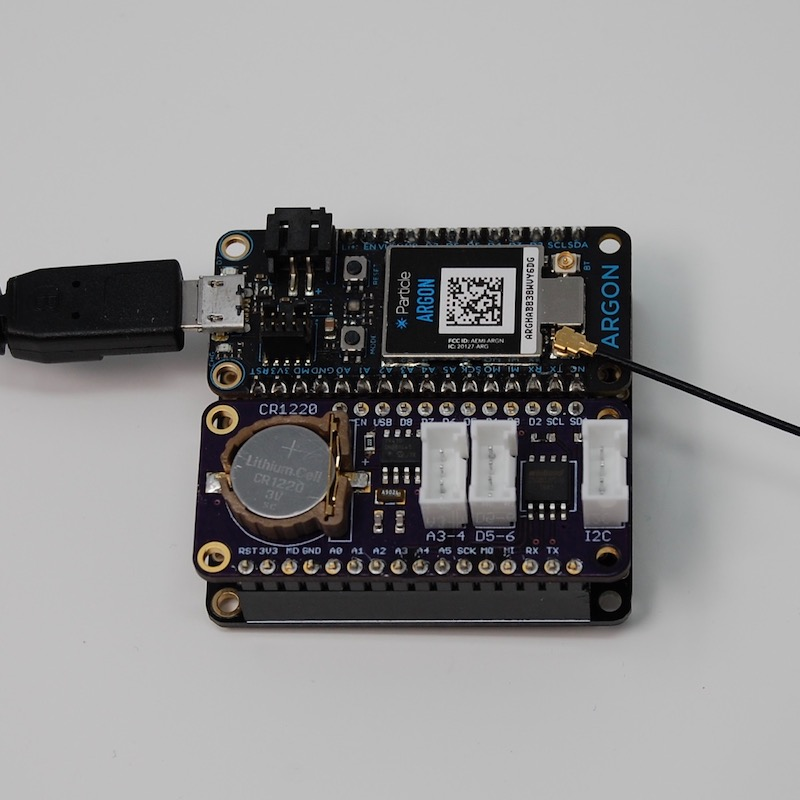
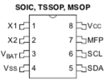
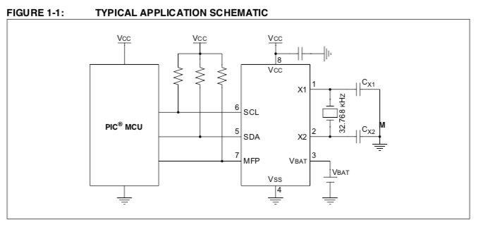

# MCP79410RK
*Particle library for MCP79410 real-time clock (RTC) chip with I2C interface*

You can find the full browsable API docs [here](http://rickkas7.github.io/MCP79410RK/class_m_c_p79410.html).

## Hardware

 

This is a sample board that includes an MCP79410 in an Adafruit FeatherWing form-factor. The documentation and Eagle CAD files for this project can be [found here](https://github.com/rickkas7/RtcFlashFeatherWingRK).

The MCP79410 is a tiny 8-pin chip:



With a simple application circuit:



You only need some pull-up resistors, a 32.768 kHz crystal, and a few capacitors.

It connects by I2C and uses addresses 0x6f (registers and SRAM) and 0x57 (EEPROM). 


## The MFP pull-up

The MFP (multi-function pin) is useful when waking up from SLEEP\_MODE\_DEEP based on time on Gen 3 devices (Argon, Boron, Xenon). You connect MFP to D8 for this purpose.

However, you must be careful: Using D8 as a wake-up pin is active high, rising. The MFP is open-collector and requires a pull-up.

However, in SLEEP\_MODE\_DEEP, an internal pull-down (about 13K) is applied to D8 so it doesn't float if not connected. Thus you must use a small-resistance pull-up or the signal won't go high enough because of the conflicting pull-up and pull-down.

A 2.2K pull-up works fine for this purpose.

Or you could use an actual inverter or transistor, if you prefer.

If you use a typical 10K pull-up on MFP, in wake the signal will only reach 1.9V because of the 10K pull-up and the 13K internal pull-down, and that's too low of a voltage to register as high and end sleep mode.

## Common Patterns

### RTC Clock Synchronization

By default, bi-directional clock synchronization is done. 

- During setup() if Time is not valid but the RTC is, then Time is set from RTC. This is useful because Time is not maintained in SLEEP\_MODE\_DEEP.
- During loop(), after Time is synchronized with the cloud, the RTC is updated. This only happens once at boot.

You must call the setup() and loop() methods, as shown in the following example.

### Using RTC to wake from SLEEP\_MODE\_DEEP

Here's a simple program to wake from SLEEP\_MODE\_DEEP:

```
#include "MCP79410RK.h"

SerialLogHandler logHandler;

MCP79410 rtc;

void setup() {
	// Make sure you call rtc.setup() from setup!
	rtc.setup();
}

void loop() {
	// Make sure you call rtc.loop() from loop!
	rtc.loop();


	// Wait 20 seconds after boot to try sleep
	if (millis() > 20000) {
		if (rtc.setAlarm(10)) {
			Log.info("About to SLEEP_MODE_DEEP for 10 seconds");
			System.sleep(SLEEP_MODE_DEEP);
		}
		else {
			Log.info("Failed to setAlarm, not sleeping");
			delay(10000);
		}
	}
}
```

For Gen 2 devices, you might do something like:

```
System.sleep(SLEEP_MODE_DEEP, 10);
```

but using the RTC it would be:

```
if (rtc.setAlarm(10)) {
    System.sleep(SLEEP_MODE_DEEP);
}
```

The reason for the error check around setAlarm is that the alarm can only be set after the RTC has been set to the correct time. Upon cold boot (no 3V3, no battery) the RTC won't be set and sleep cannot be used until the first clock synchronization. This is true even when delaying by seconds.

You can also use rtc.isRTCValid() to determine if the RTC is believed to be correct. If isRTCValid() returns true, then setAlarm() will typically return true as well. This is handy if you want to preflight setAlarm() before turning off the network connection, for example.

### Using SRAM

The MCP79410 contains 64 bytes of battery-backed SRAM. This is handy if you want to store data data. This can be written to quickly and does not wear out. The data is preserved by the backup battery (CR1220 in the design above) when there is no power on 3V3.

The API works like the EEPROM API in Device OS:

```
int a = 1234;
rtc.sram().put(0, a);

a = 0;

rtc.sram().get(0, a);

// a = 1234 again
```

The first parameter is 0, and that is a byte offset. Make sure you leave enough room! The next data should be written at 4, leaving enough room to save the 4-byte (32-bit) integer.

You can get and put simple data bytes (int, bool, uint32_t, etc.) and struct.

Note that you cannot put a String variable or char *! You need to set aside enough bytes and copy the string to the bytes.

### Using EEPROM

The MCP79410 contains 128 bytes of byte-writable EEPROM. This is slower to write to, but the data is preserved forever, even with no battery. The EEPROM can also wear out; it's rated for 1 million erase-write cycles for each byte.

The API works like the EEPROM API in Device OS:

```
int a = 1234;
rtc.eeprom().put(0, a);

a = 0;

rtc.eeprom().get(0, a);

// a = 1234 again
```


### Using the Protected EEPROM Block

In addition to the 128 bytes of EEPROM, there's a special block of 8 additional bytes of EEPROM. This is harder to access and accidentally erase. 

This is often used for things like MAC addresses, however I think it would be perfect for storing board revision and capability information.

The 7-board-id-set example shows how to store data in the protected EEPROM.

The 8-board-id example shows how to read it:

```
// This example shows how you'd read an 8-byte structure with information about your board (that has the RTC on it)
// from protected block EEPROM.
//
// You'd run code like the 7-board-id-set example to set the values during manufacture.
//
// You'd add code like the following to your own firmware to read the structure and presumably do something with it other
// than just print it to debug serial.

#include "MCP79410RK.h"

SYSTEM_THREAD(ENABLED);

SerialLogHandler logHandler;
MCP79410 rtc;

typedef union {
	struct {
		uint16_t boardType;
		uint16_t boardVersion;
		uint32_t featureFlags;
	} data;
	uint8_t bytes[MCP79410::EEPROM_PROTECTED_BLOCK_SIZE]; // 8 bytes
} BoardId;


void setup() {
	rtc.setup();

	// Wait for a USB serial connection for up to 10 seconds. This is just so you can see the Log.info
	// statement, you'd probably leave this out of real code
	waitFor(Serial.isConnected, 10000);

	// Read the BoardId structure from the protected block EEPROM
	BoardId boardId;
	rtc.eeprom().protectedBlockRead(boardId.bytes);

	Log.info("boardType=%04x boardVersion=%04x featureFlags=%08x", boardId.data.boardType, boardId.data.boardVersion, boardId.data.featureFlags);
}

void loop() {
	rtc.loop();
}
```

## Version History

### 0.0.3 (2019-05-05)

- Fixed a bug in polarity=false where the bit would not get cleared once set


